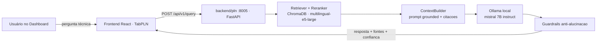

# OVERWATCH — Global Solution 2026

Plataforma de monitoramento climático e de desastres naturais que integra um pipeline
RPA, modelos de Machine Learning clássico/quântico e Visão Computacional, com um
frontend React unificado (HUD "Mission Control").

Projeto desenvolvido para a **FIAP Global Solution 2026**, cobrindo múltiplas
disciplinas do curso em um único produto.

## Arquitetura

```
Global-Solution---2026--/
├── backend/
│   ├── rpa/                    # Pipeline OVERWATCH — RPA (FastAPI :8000)
│   │   ├── api.py              # API REST do pipeline
│   │   ├── pipeline.py         # Orquestrador CLI
│   │   ├── modulo1_gerador.py  # Geração de dados satelitais
│   │   ├── modulo2_ingestao.py # Ingestão e limpeza
│   │   ├── modulo3_anomalias.py# Detecção de anomalias (Isolation Forest)
│   │   ├── modulo4_classificacao_ia.py # Classificação com Gemini
│   │   ├── modulo5_relatorio.py# Relatório Excel + JSON
│   │   └── README.md
│   ├── quantica/               # QML — classificação climática (FastAPI :8001)
│   │   ├── api.py              # SVM-RBF, Random Forest, QSVC, VQC
│   │   └── *.pkl / *.model     # Modelos treinados (NASA POWER)
│   ├── visao-computacional/    # Visão Computacional (FastAPI :8002)
│   │   ├── api.py              # Detecção de incêndios (MobileNetV2)
│   │   ├── modelo_wildfire.keras
│   │   └── README.md
│   ├── genai/                  # GenAI / RAG — ORBITAL SENTINEL (FastAPI :8003)
│   ├── neuromorfica/           # Computação Neuromórfica — NeuroSpace Alert (FastAPI :8004)
│   │   ├── api.py              # Sensor neuromórfico (memristor virtual)
│   │   └── README.md
│   └── pln/                    # PLN — RAG SUETERES, Edifícios Verdes (FastAPI :8005)
│       ├── api/                # FastAPI app · routers (health/query/ingest/sources)
│       ├── rag/                # Pipeline RAG (retriever, reranker, llm_client, guardrails...)
│       ├── ingestion/ vector_store/ document_store/ domain/ config/
│       ├── corpus/             # 15 documentos técnicos pré-curados
│       ├── evaluation/         # Notebook + métricas RAG vs LLM puro
│       └── README.md
├── frontend/                   # React + Vite (porta 3000)
│   └── src/
│       ├── App.jsx             # Abas: Dashboard, RPA, Generative AI, PLN, Visão, IoT, Neuro, Quântica
│       └── services/api.js     # Cliente HTTP centralizado
├── docs/
│   └── INTEGRATION_PLAN.md     # Auditoria + arquitetura + riscos da integração do módulo PLN
├── docker-compose.yml
└── README.md
```

## Módulos

### 1. RPA — Pipeline OVERWATCH (porta 8000)

Pipeline em 5 etapas que gera dados climáticos satelitais, detecta anomalias com
Isolation Forest e classifica cada evento com o Google Gemini, produzindo um
relatório Excel e um JSON consumido pelo dashboard.

### 2. Computação Quântica e IA (porta 8001)

Ensemble que compara modelos clássicos (SVM-RBF, Random Forest) com modelos
quânticos (QSVC, VQC / Qiskit) na classificação de eventos climáticos extremos,
treinados com dados reais da NASA POWER (São Paulo, 2015–2022). Inclui consulta
ao vivo à API NASA POWER e classificação por votação.

### 3. Visão Computacional (porta 8002)

CNN **MobileNetV2** (transfer learning) que classifica imagens aéreas/satélite em
`incêndio` ou `sem incêndio`. Treinada no Wildfire Prediction Dataset (Kaggle),
atingindo **95,13% de acurácia** e **AUC 0,987** no conjunto de teste.
Detalhes em [backend/visao-computacional/README.md](backend/visao-computacional/README.md).

### 4. Computação Neuromórfica — NeuroSpace Alert (porta 8004)

Sensor neuromórfico de baixo consumo com **memristor virtual**: temperatura, radiação e
poeira são convertidas em uma tensão de entrada que alimenta um estado com memória local
(`w`), acionando um LED de alerta (apagado → amarelo → vermelho). Três ajustes calibram a
sensibilidade da detecção de condição crítica em uma estação remota monitorada por satélite.
Detalhes em [backend/neuromorfica/README.md](backend/neuromorfica/README.md).

### 5. PLN — Assistente Técnico RAG · SUETERES (porta 8005)

Assistente técnico especializado em **Edifícios Verdes e Net Zero de Energia e Água**,
construído com um pipeline **RAG (Retrieval-Augmented Generation)** local e auditável:
ChromaDB (vetores) + `multilingual-e5-large` (embeddings) + reranker cross-encoder +
**Mistral 7B via Ollama local**, com guardrails anti-alucinação em 5 camadas e citação
obrigatória das fontes em formato ABNT.



Corpus técnico próprio com **15 documentos normativos** (LEED v4.1, AQUA-HQE, ABNT NBR
15575/10844, Selo Casa Azul+, PROCEL Edifica, ANA, CBCS, EPE, ABSOLAR, ASHRAE 90.1, ABESCO,
IEA, entre outros), pré-indexados (61 chunks). Desenvolvido na disciplina de PLN e integrado
ao OVERWATCH como microsserviço plugável — exemplo de pergunta:

> *"Quais práticas de reúso de água podem ser aplicadas em regiões afetadas por seca?"*

Detalhes em [backend/pln/README.md](backend/pln/README.md),
[backend/pln/AUDITORIA_FINAL_PLN.md](backend/pln/AUDITORIA_FINAL_PLN.md) e
[docs/INTEGRATION_PLAN.md](docs/INTEGRATION_PLAN.md).

> ⚠️ Requer [Ollama](https://ollama.com) rodando localmente com o modelo
> `mistral:7b-instruct-v0.3-q4_K_M` (`ollama pull mistral:7b-instruct-v0.3-q4_K_M`).

## Início rápido

### Requisitos
- Python 3.9+ (recomendado 3.11)
- Node.js 18+
- Git
- (Opcional) Docker e Docker Compose

### Frontend

```bash
cd frontend
npm install
npm run dev
# http://localhost:3000
```

### Backends

Cada backend é independente e roda em sua própria porta. Rode os que precisar:

```bash
# RPA (porta 8000)
cd backend/rpa
pip install -r requirements.txt
python api.py

# Quântica (porta 8001)
cd backend/quantica
pip install -r requirements.txt
python api.py

# Visão Computacional (porta 8002)
cd backend/visao-computacional
pip install -r requirements.txt
python api.py

# Neuromórfica (porta 8004)
cd backend/neuromorfica
pip install -r requirements.txt
python api.py

# PLN — Assistente RAG SUETERES (porta 8005, requer Ollama local)
cd backend/pln
pip install -r requirements.txt
ollama pull mistral:7b-instruct-v0.3-q4_K_M
python scripts/ingest_corpus.py ingest-corpus --corpus-dir ./corpus --force   # 1ª vez
uvicorn api.main:app --host 0.0.0.0 --port 8005
```

O frontend lê as URLs dos backends via variáveis Vite (com fallback para localhost):

| Variável                | Padrão                  | Backend              |
|-------------------------|-------------------------|----------------------|
| `VITE_API_BASE_URL`     | `http://localhost:8000` | RPA                  |
| `VITE_QUANTUM_API_URL`  | `http://localhost:8001` | Quântica             |
| `VITE_VISION_API_URL`   | `http://localhost:8002` | Visão Computacional  |
| `VITE_GENAI_API_URL`    | `http://localhost:8003` | GenAI / RAG          |
| `VITE_NEURO_API_URL`    | `http://localhost:8004` | Neuromórfica         |
| `VITE_PLN_API_URL`      | `http://localhost:8005` | PLN / RAG (SUETERES) |

## Endpoints principais

### RPA (8000)
| Método | Endpoint | Descrição |
|--------|----------|-----------|
| GET  | `/status` | Estado da API e do pipeline |
| POST | `/pipeline/rodar` | Dispara o pipeline em background |
| GET  | `/resultados` | JSON completo |
| GET  | `/resultados/resumo` | KPIs do dashboard |
| GET  | `/resultados/alertas` | Alertas (filtro por severidade/região) |
| GET  | `/resultados/regioes` | Estatísticas por região |
| GET  | `/resultados/serie-temporal` | Série temporal |

### Quântica (8001)
| Método | Endpoint | Descrição |
|--------|----------|-----------|
| GET  | `/quantica/status` | Estado da API e dos modelos |
| GET  | `/quantica/modelos` | Métricas e configuração dos modelos |
| POST | `/quantica/prever` | Classifica um dia climático |
| POST | `/quantica/buscar-e-prever` | Busca NASA POWER e classifica |

### Visão Computacional (8002)
| Método | Endpoint | Descrição |
|--------|----------|-----------|
| GET  | `/visao/status` | Estado da API e do modelo |
| GET  | `/visao/info` | Arquitetura, dataset e métricas |
| POST | `/visao/prever` | Classifica uma imagem (multipart `file`) |

### Neuromórfica (8004)
| Método | Endpoint | Descrição |
|--------|----------|-----------|
| GET  | `/neuro/status`  | Estado da API e do dataset |
| GET  | `/neuro/info`    | Cenário, modelo conceitual e parâmetros |
| GET  | `/neuro/ajustes` | Resumo comparativo dos três ajustes |
| POST | `/neuro/simular` | Roda a simulação (`V_limiar`, `taxa_chaveamento`) |

### PLN — Assistente RAG SUETERES (8005)
| Método | Endpoint | Descrição |
|--------|----------|-----------|
| GET  | `/health` | Estado da API, contagem de vetores e disponibilidade do LLM |
| POST | `/api/v1/query` | Consulta o assistente técnico (RAG) — requer header `X-API-Key` |
| GET  | `/api/v1/sources` | Lista os documentos indexados no corpus — requer `X-API-Key` |
| POST | `/api/v1/ingest` | Ingestão de novos documentos no corpus — requer `X-API-Key` |

Cada backend expõe documentação Swagger automática em `/docs`
(ex.: http://localhost:8002/docs).

## Docker

```bash
docker-compose up -d           # sobe os serviços
docker-compose logs -f         # acompanha os logs
docker-compose down            # encerra
```

## Segurança

- Nunca faça commit do arquivo `.env` (já protegido pelo `.gitignore`).
- Armazene chaves de API (ex.: `GOOGLE_API_KEY`) em variáveis de ambiente.
- Em produção, restrinja o CORS às origens do frontend.

## Licença

Distribuído sob a licença MIT.

---

Desenvolvido para a FIAP Global Solution 2026.
