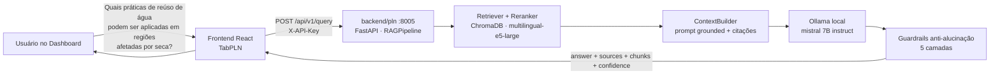

# Plano de Integração — RAG SUETERES (gs1-pln) ao OVERWATCH

**Data:** 2026-06-07
**Escopo:** Integrar o assistente RAG da disciplina de PLN (projeto `gs1-pln`, codinome
*Sueteres*, especialista em Edifícios Verdes e Net Zero de Energia e Água) ao repositório
principal da Global Solution (**OVERWATCH**), sem quebrar funcionalidades existentes.

---

## 1. Auditoria — Arquitetura Atual

### 1.1 Repositório principal (OVERWATCH)

Monorepo com **frontend único (React + Vite)** consumindo **múltiplos backends FastAPI
independentes**, um por disciplina/módulo, cada um em sua própria porta:

```
Global-Solution---2026--/
├── backend/
│   ├── rpa/                 → FastAPI :8000  (Pipeline RPA + IA — Gemini)
│   ├── quantica/            → FastAPI :8001  (ML clássico/quântico — Qiskit)
│   ├── visao-computacional/ → FastAPI :8002  (CNN MobileNetV2 — wildfire)
│   ├── genai/               → FastAPI :8003  (RAG "ORBITAL SENTINEL" — LlamaIndex+Groq)
│   └── neuromorfica/        → FastAPI :8004  (Sensor neuromórfico — memristor virtual)
├── frontend/                → React + Vite :3000
│   └── src/
│       ├── App.jsx          → Tabs/rotas por disciplina (Dashboard, RPA, Generative AI,
│       │                       PLN [placeholder], Visão, IoT, Neuromórfica, Quântica)
│       └── services/api.js  → Cliente HTTP único, com um `<modulo>Request()` por backend
└── docker-compose.yml       → Orquestra todos os serviços + Postgres + pgAdmin
```

**Padrão arquitetural identificado (e que deve ser preservado):**
- Cada disciplina/módulo é um **microsserviço FastAPI autônomo** em `backend/<modulo>/`,
  com seu próprio `api.py`/`api/`, `requirements.txt` e `Dockerfile`, exposto em porta dedicada.
- O frontend **nunca acessa um backend diretamente** — toda chamada passa por
  `APIService` (`frontend/src/services/api.js`), que centraliza URLs (via `import.meta.env`)
  e expõe métodos `<modulo>Request()` / `<modulo>Xxx()`.
- Cada disciplina tem uma aba/rota dedicada em `App.jsx`, registrada no array `TABS`.
- **Já existe uma rota reservada para PLN**: `{ id: 'pln', path: '/pln', label: 'PLN',
  subject: 'PLN, Chatbots & Virtual Agents' }`, renderizando até então um `TabPlaceholder`
  ("Em construção"). Esse é o ponto de integração natural — não foi necessário criar
  nenhuma rota nova.
- Já existe inclusive **outro módulo de RAG no monorepo** (`backend/genai`, "ORBITAL
  SENTINEL", disciplina Generative AI): usa **LlamaIndex + FastEmbed/ONNX + Groq (LLM em
  nuvem)** — pilha totalmente diferente da do `gs1-pln` (ChromaDB + sentence-transformers +
  Ollama local). São **propositalmente independentes**: cada um corresponde a uma disciplina
  e a um corpus distinto (espacial/desastres vs. edifícios verdes), não há sobreposição de
  domínio nem motivo para fusão.

### 1.2 Projeto gs1-pln (RAG Sueteres)

Aplicação FastAPI **standalone e já madura**, com Clean Architecture própria:

```
gs1-pln/
├── api/            → FastAPI app (main.py, routers: health/query/ingest/sources, schemas, middleware)
├── domain/         → Entidades e exceções de domínio
├── rag/            → Pipeline RAG (query_processor, embedder, retriever, reranker,
│                      context_builder, llm_client, guardrails, citation_formatter)
├── ingestion/      → Orquestrador de ingestão + chunkers hierárquicos
├── vector_store/   → ChromaVectorStore (ChromaDB persistente)
├── document_store/ → SQLiteDocumentStore (WAL) + sueteres.db (15 docs / 61 chunks)
├── config/         → Settings (pydantic-settings) + prompts + logging
├── corpus/         → 15 documentos técnicos (PDF/DOCX) já curados
├── evaluation/     → Notebook de avaliação + métricas comparativas RAG vs LLM puro
├── scripts/        → CLI de ingestão (`ingest_corpus.py`)
├── tests/          → Suíte unitária + integração
├── Dockerfile, pyproject.toml, requirements.txt, .env(.example)
└── chroma_db/, models/, logs/  → artefatos gerados em runtime (gitignored)
```

- **Já expõe uma API REST própria e completa**: `GET /health`, `POST /api/v1/query`,
  `GET /api/v1/sources`, `POST /api/v1/ingest`, autenticação via header `X-API-Key`.
- **Pilha:** ChromaDB + `intfloat/multilingual-e5-large` + reranker
  `cross-encoder/ms-marco-MiniLM-L-6-v2` + LLM **Ollama local** (`mistral:7b-instruct-v0.3-q4_K_M`).
- **Guardrails anti-alucinação em 5 camadas** (threshold de score, grounding via prompt,
  cobertura de citação, checagem numérica, score de confiança) — já validados em runtime
  (ver `VALIDACAO_RUNTIME.md` / `AUDITORIA_FINAL_PLN.md`, 0/5 fallbacks em consultas reais).
- Configuração 100% via `.env` / `pydantic-settings` — pronto para "plug and play".

---

## 2. Dependências, Pontos de Integração, Conflitos e Duplicidades

| Item | Situação |
|---|---|
| **Dependências de runtime** | gs1-pln requer **Ollama local** rodando `mistral:7b-instruct-v0.3-q4_K_M` (~4-5 GB) e baixa modelos de embedding/reranker (~2 GB) na primeira execução — isolados em `models/` (gitignored). Não conflita com nenhuma dependência dos demais módulos. |
| **Portas** | OVERWATCH usa 8000-8004 + 3000 (frontend) + 5432/5050 (Postgres/pgAdmin). gs1-pln usa **8000 por padrão** → **conflito direto com `backend/rpa`**. Resolução: realocar para **porta 8005** (próxima livre na sequência). |
| **Ponto de integração no frontend** | Rota `/pln` e entrada `TABS` já existiam, renderizando `TabPlaceholder`. Substituído por um componente real `TabPLN`, seguindo o padrão de `TabGenerative`. |
| **Ponto de integração no `APIService`** | Adicionado bloco `PLN_API_URL` + `plnRequest/plnHealth/plnSources/plnQuery`, no mesmo padrão de `genaiRequest`/`neuroRequest`. |
| **Duplicidade de "RAG"** | Não há duplicidade real: `backend/genai` (ORBITAL SENTINEL) e `backend/pln` (SUETERES) atendem **domínios de conhecimento e disciplinas diferentes** (clima/desastres vs. edificações sustentáveis), com pilhas técnicas e corpora próprios. Mantê-los separados está alinhado ao requisito de "permitir que futuras disciplinas sejam plugadas da mesma forma" — cada um é a prova de que o padrão escala. |
| **Banco de dados** | gs1-pln usa **SQLite + ChromaDB próprios** (arquivos locais em `document_store/` e `chroma_db/`), não compartilha o Postgres do `docker-compose`. Nenhum conflito de schema. |
| **Variáveis de ambiente** | gs1-pln tem seu próprio `.env`/`.env.example` totalmente autocontido (não colide com variáveis dos outros serviços). No `docker-compose`, basta acrescentar o serviço e expor `VITE_PLN_API_URL` ao frontend, no mesmo padrão de `VITE_GENAI_API_URL`/`VITE_NEURO_API_URL`. |
| **Autenticação** | gs1-pln exige `X-API-Key` nos endpoints `/api/v1/*` (não no `/health`). O frontend precisa enviar esse header — adicionado em `plnRequest`. |

**Conclusão da auditoria:** não há conflitos arquiteturais relevantes além da porta. A
estrutura `src/ai/rag/{application,domain,infrastructure,services,api,evaluation}`
sugerida genericamente em prompts de integração **não se aplica a este monorepo**: o
OVERWATCH não usa uma camada `src/` nem um backend único — usa microsserviços
FastAPI desacoplados por disciplina, já testados e em produção. Forçar essa estrutura
exigiria reescrever o `gs1-pln` (que já segue Clean Architecture própria, validada e
testada) e quebraria a convenção que todo o restante do monorepo segue.

---

## 3. Arquitetura Proposta (final)

> **Princípio:** integrar respeitando a convenção existente — *"a mesma receita que já
> funciona para RPA, Quântica, Visão, GenAI e Neuromórfica"* — em vez de importar uma
> estrutura genérica externa. Isso é o que garante baixo acoplamento, zero regressão e
> replicabilidade para futuras disciplinas (exatamente o requisito do desafio).

```
Global-Solution---2026--/
├── backend/
│   ├── rpa/                 :8000
│   ├── quantica/            :8001
│   ├── visao-computacional/ :8002
│   ├── genai/               :8003   (RAG · ORBITAL SENTINEL — clima/desastres)
│   ├── neuromorfica/        :8004
│   └── pln/                 :8005   (RAG · SUETERES — edifícios verdes) ← NOVO
│       ├── api/ domain/ rag/ ingestion/ vector_store/ document_store/
│       ├── config/ corpus/ evaluation/ scripts/ tests/
│       ├── Dockerfile · requirements.txt · pyproject.toml · .env(.example)
│       └── (chroma_db/ models/ logs/ — gerados em runtime, gitignored)
├── frontend/
│   └── src/
│       ├── App.jsx            → TABS['pln'] agora renderiza <TabPLN/> (chat + fontes + confiança)
│       └── services/api.js    → + PLN_API_URL · plnHealth/plnSources/plnQuery
└── docker-compose.yml         → + serviço `backend-pln` (:8005) · + VITE_PLN_API_URL no frontend
```

**Fluxo de uma consulta (exemplo do desafio):**



### Por que NÃO mover o código para `src/ai/rag/...`
1. **Quebraria a convenção do monorepo** — todos os módulos vivem em `backend/<nome>/`
   como serviços FastAPI standalone; introduzir uma camada `src/` criaria dois padrões
   coexistindo, aumentando acoplamento cognitivo.
2. **gs1-pln já aplica Clean Architecture/SOLID internamente** (`domain/`, `rag/`,
   `infrastructure` equivalente em `vector_store/`+`document_store/`, `api/` como camada
   de apresentação) — reescrevê-lo apenas para encaixar em nomes de pastas diferentes
   seria reformatação cosmética com alto risco de regressão e zero ganho real.
3. **Desacoplamento já é total**: o serviço é consumido apenas via HTTP/REST
   (`/api/v1/query`), exatamente como pede o requisito de "serviço único" — só que
   exposto como API HTTP (o padrão de comunicação de todo o monorepo) em vez de
   import Python direto, o que é estritamente melhor para escalabilidade e para permitir
   que o módulo rode em hardware separado (ele já requer GPU/CPU dedicada para embeddings
   + Ollama).

---

## 4. Riscos

| Risco | Severidade | Mitigação |
|---|---|---|
| Conflito de porta 8000 com `backend/rpa` | Alta (bloqueante) | Realocada para porta **8005** em `.env`, `.env.example`, `Dockerfile` (`EXPOSE`/`HEALTHCHECK`/`CMD`) e `docker-compose.yml`. |
| Dependência de **Ollama local** (não containerizado no `docker-compose` principal) | Média | Documentado no README e na aba do frontend (`TabPLN` exibe aviso de offline com instrução de inicialização). Evolução futura: adicionar serviço Ollama ao `docker-compose`. |
| Tamanho de `models/` (~2,2 GB, baixado sob demanda) | Média | Mantido fora do controle de versão (gitignored) — apenas código + corpus + bases pré-ingeridas (`document_store/sueteres.db`, ~450 KB) foram copiados. |
| `chroma_db/` vazio após integração (não versionado) | Média | Necessário rodar `python scripts/ingest_corpus.py ingest-corpus --corpus-dir ./corpus --force` no primeiro setup — documentado no README do módulo e no relatório de integração. |
| Frontend chamando backend offline | Baixa | `TabPLN` trata erro de rede com mensagem orientativa, sem quebrar o restante do dashboard (mesmo padrão de `TabGenerative`/`TabNeuro`). |
| Autenticação por API Key divergente do padrão dos demais módulos (que não autenticam) | Baixa | Header `X-API-Key` adicionado apenas nas chamadas `plnRequest`; chave de desenvolvimento documentada em `.env.example`; trocar em produção. |

---

## 5. Estratégia de Migração

1. **Cópia seletiva do código-fonte** de `gs1-pln` para `backend/pln/`, excluindo
   artefatos gerados em runtime (`models/`, `chroma_db/`, `logs/`, `.git/`, `__pycache__/`)
   — preservando o `.gitignore` original.
2. **Realocação de porta** 8000 → 8005 em todos os pontos de configuração
   (`.env`, `.env.example`, `Dockerfile`).
3. **Registro no orquestrador**: novo serviço `backend-pln` em `docker-compose.yml`,
   seguindo exatamente o template dos demais serviços `backend-*`.
4. **Extensão do `APIService`** (`frontend/src/services/api.js`) com o bloco
   `PLN_API_URL`/`plnRequest`/`plnHealth`/`plnSources`/`plnQuery`, no mesmo padrão dos
   blocos `genai*`/`neuro*` já existentes — sem alterar nenhum método pré-existente.
5. **Substituição do placeholder**: a rota `/pln` (já existente em `TABS`) passa a
   renderizar `<TabPLN/>` — um componente novo, modelado em `TabGenerative`, sem alterar
   nenhuma outra aba/rota.
6. **Atualização de documentação**: README principal recebe seção do módulo PLN +
   diagrama Mermaid; `docs/RAG_INTEGRATION_REPORT.md` documenta tudo o que foi criado/
   alterado, fluxo, evidências e pendências.
7. **Nenhum arquivo pré-existente foi removido**; nenhuma funcionalidade dos módulos
   RPA/Quântica/Visão/GenAI/Neuromórfica foi alterada.

---

## 6. Preparação para futuras disciplinas

Este mesmo roteiro (cópia para `backend/<disciplina>/`, porta dedicada N+1, bloco
`<disciplina>Request` em `api.js`, aba em `TABS` + componente `Tab<Disciplina>`,
serviço no `docker-compose`) é **replicável integralmente** para qualquer novo módulo —
exatamente o objetivo de "permitir que futuras disciplinas sejam plugadas da mesma forma".
