# Relatório de Integração — RAG SUETERES (gs1-pln) ao OVERWATCH

**Data:** 2026-06-07
**Módulo integrado:** Assistente Técnico RAG da disciplina de PLN (`gs1-pln` → `backend/pln`)
**Plano de referência:** [`docs/INTEGRATION_PLAN.md`](./INTEGRATION_PLAN.md)

---

## 1. Resumo

O sistema RAG **SUETERES** (corpus técnico sobre Edifícios Verdes e Net Zero de Energia e
Água, pipeline ChromaDB + `multilingual-e5-large` + Mistral 7B via Ollama, com guardrails
anti-alucinação em 5 camadas) foi integrado ao monorepo **OVERWATCH** como um novo
microsserviço backend (`backend/pln`, porta **8005**), seguindo exatamente o mesmo padrão
arquitetural já usado pelos módulos RPA, Quântica, Visão Computacional, GenAI e
Neuromórfica — sem alterar nenhuma funcionalidade pré-existente.

A aba **PLN** do dashboard, que antes exibia um placeholder "Em construção", agora é um
**Assistente Técnico** funcional: campo de pergunta livre, exemplos sugeridos, resposta
gerada pelo RAG, fontes citadas (com formato ABNT) e score de confiança.

---

## 2. Arquivos Criados

| Arquivo | Descrição |
|---|---|
| `backend/pln/**` | Cópia integral do código-fonte do `gs1-pln` (api, rag, ingestion, vector_store, document_store, domain, config, corpus, evaluation, scripts, tests, Dockerfile, pyproject.toml, requirements.txt, .env, .env.example, README.md, AUDITORIA_FINAL_PLN.md, VALIDACAO_RUNTIME.md, validation_results.json) — **excluindo** artefatos gerados em runtime (`models/` ~2,2 GB, `chroma_db/`, `logs/`, `.git/`, `__pycache__/`), que permanecem fora do controle de versão conforme `.gitignore` original. |
| `docs/INTEGRATION_PLAN.md` | Auditoria completa dos dois projetos, mapeamento de arquitetura, dependências, conflitos, riscos e estratégia de migração. |
| `docs/RAG_INTEGRATION_REPORT.md` | Este relatório. |

## 3. Arquivos Modificados

| Arquivo | Alteração |
|---|---|
| `backend/pln/.env` e `.env.example` | `API_PORT` realocado de `8000` → `8005` (conflito com `backend/rpa`, que já ocupa 8000). Demais variáveis (Chroma, SQLite, LLM, embeddings) preservadas como no projeto original (já renomeadas para `sueteres_*` em sessão anterior). |
| `backend/pln/Dockerfile` | `EXPOSE`, `HEALTHCHECK` e `CMD --port` atualizados de `8000` → `8005`. |
| `backend/pln/` (raiz) | Removido `docker-compose.yml` próprio (redundante — orquestração agora centralizada no `docker-compose.yml` raiz do monorepo). |
| `docker-compose.yml` (raiz) | Adicionado serviço `backend-pln` (build `./backend/pln`, porta `8005:8005`, mesma convenção dos demais `backend-*`); adicionada variável `VITE_PLN_API_URL=http://localhost:8005` ao serviço `frontend`. |
| `frontend/src/services/api.js` | Adicionado bloco **PLN / RAG · SUETERES**: constantes `PLN_API_URL`/`PLN_API_KEY`, método genérico `plnRequest` (injeta header `X-API-Key`), e `plnHealth()`, `plnSources()`, `plnQuery(question, filters)` — no mesmo padrão de `genaiRequest`/`neuroRequest`. Nenhum método existente foi alterado. |
| `frontend/src/App.jsx` | (a) Novo componente `TabPLN` (chat de perguntas livres, chips de exemplos, exibição de resposta + fontes + confiança + cobertura + modelo, card de status/health, card de arquitetura do pipeline RAG); (b) a rota `/pln` (já existente em `TABS`, antes renderizando `TabPlaceholder`) passou a renderizar `<TabPLN/>`. Nenhuma outra rota/aba foi alterada. |
| `README.md` (raiz) | (a) Árvore de arquitetura atualizada com `backend/pln/` e `docs/`; (b) nova seção **"5. PLN — Assistente Técnico RAG · SUETERES (porta 8005)"** com diagrama Mermaid do fluxo de consulta; (c) comandos de inicialização do backend PLN em "Início rápido"; (d) variável `VITE_PLN_API_URL` na tabela de URLs; (e) tabela de endpoints `/health`, `/api/v1/query`, `/api/v1/sources`, `/api/v1/ingest`. |

---

## 4. Fluxo de Integração

```mermaid
flowchart LR
    U[Usuário no Dashboard] -->|"Quais praticas de reuso de agua\npodem ser aplicadas em regioes\nafetadas por seca?"| FE[Frontend React\nTabPLN]
    FE -->|"POST /api/v1/query\nheader X-API-Key"| API[backend/pln :8005\nFastAPI · RAGPipeline]
    API --> QP[QueryProcessor]
    QP --> EMB[Embedder\nmultilingual-e5-large]
    EMB --> RET[Retriever\nChromaDB · 61 vetores]
    RET --> RRK[Reranker\ncross-encoder MiniLM]
    RRK --> ICC[InCorpusChecker\nthreshold 0.35]
    ICC --> CTX[ContextBuilder\nprompt numerado T1..T5]
    CTX --> LLM[OllamaClient\nmistral 7B instruct local]
    LLM --> GRD[Guardrails\n5 camadas anti-alucinacao]
    GRD -->|"answer + documents_used\n+ chunks_used + confidence"| FE
    FE -->|"resposta + fontes ABNT\n+ score de confianca"| U
```



**Camadas atravessadas por uma requisição:**
1. `TabPLN` (React) chama `APIService.plnQuery(pergunta)`.
2. `APIService.plnRequest` monta a requisição HTTP com `Content-Type: application/json`
   e `X-API-Key`, contra `PLN_API_URL` (`VITE_PLN_API_URL`, padrão `http://localhost:8005`).
3. `POST /api/v1/query` (FastAPI, `api/routers/query.py`) valida a API key
   (`verify_api_key`) e delega ao `RAGPipeline.query()`.
4. O pipeline retorna `RAGResponse` com `answer`, `chunks_used`, `documents_used`,
   `citations_abnt`, `response_confidence`, `coverage_level`, `model_used`, flags de
   alucinação etc., serializado via `QueryResponseSchema`.
5. `TabPLN` exibe a resposta, badges de confiança/cobertura/modelo e cartões de fonte
   (com `citation_abnt` em tooltip).

---

## 5. Testes Executados

| Teste | Resultado |
|---|---|
| Leitura estática do `App.jsx` após edição (rotas, `TABS`, JSX de `TabPLN`) | ✅ Sem duplicidade de identificadores; rota `/pln` aponta para `TabPLN`; demais rotas inalteradas |
| Conferência do contrato de API (`QueryResponseSchema`, `HealthSchema`, `SourceSchema` em `api/schemas/response.py`) vs. campos consumidos por `TabPLN`/`api.js` | ✅ Campos (`answer`, `documents_used[].title/citation_abnt`, `response_confidence`, `coverage_level`, `model_used`, `vector_store_count`, `llm_available`, `status`) conferem |
| Conferência do middleware de autenticação (`api/middleware/auth.py`) vs. header enviado por `plnRequest` | ✅ Header `X-API-Key` (alias correto) |
| Verificação de conflito de porta no `docker-compose.yml` (8000-8004 vs. nova entrada 8005) | ✅ Sem conflito — `backend-pln` ocupa 8005, única porta livre na sequência |
| Suíte de testes unitários/integração pré-existente do `gs1-pln` (`tests/`) | ⚠️ Não reexecutada nesta sessão (suíte copiada integralmente para `backend/pln/tests/`; já validada no projeto de origem — ver `AUDITORIA_FINAL_PLN.md`/`VALIDACAO_RUNTIME.md`) |
| Smoke test ponta-a-ponta (consulta real via dashboard integrado) | ⚠️ Pendente — requer subir `backend/pln` (Ollama local + ingestão do corpus) e o frontend simultaneamente; ver seção "Pendências" |

> Os testes de #1 a #4 foram realizados por leitura/conferência estática de código
> (schemas, middleware, JSX, docker-compose) — não houve execução de processos, pois o
> módulo depende de Ollama local e de modelos de ~2 GB que não fazem parte deste ambiente
> de integração.

---

## 6. Evidências

- **Validação funcional do RAG (origem):** `backend/pln/VALIDACAO_RUNTIME.md` — 5 consultas
  reais, 0/5 fallbacks, citações `[T1]`...`[T5]` em todas as respostas, ChromaDB populado
  (`sueteres_corpus`, 61 vetores), SQLite com 15 documentos / 61 chunks.
- **Auditoria de conformidade da disciplina:** `backend/pln/AUDITORIA_FINAL_PLN.md`.
- **Avaliação comparativa RAG vs. LLM puro:** `backend/pln/evaluation/` (notebook +
  `evaluation_results.json`: `rag_avg_cs = 8.43` vs. `llm_avg_cs = 3.18`, Δ = 5.25).
- **Padrão de integração replicado:** comparação lado a lado entre `TabGenerative`/
  `genaiRequest` (módulo GenAI, já em produção no monorepo) e `TabPLN`/`plnRequest`
  (novo módulo) — estrutura, nomenclatura e tratamento de erro idênticos.

---

## 7. Pendências

1. **Subir o serviço e rodar a ingestão no ambiente alvo:**
   ```bash
   cd backend/pln
   pip install -r requirements.txt
   ollama pull mistral:7b-instruct-v0.3-q4_K_M
   python scripts/ingest_corpus.py ingest-corpus --corpus-dir ./corpus --force
   uvicorn api.main:app --host 0.0.0.0 --port 8005
   ```
   (`chroma_db/`, `models/` e `logs/` são gerados/baixados nessa etapa — não foram
   versionados, conforme `.gitignore` original do projeto.)
2. **Smoke test ponta-a-ponta real**: com o backend `pln` e o frontend rodando
   simultaneamente, validar a pergunta-exemplo do desafio
   ("Quais práticas de reúso de água podem ser aplicadas em regiões afetadas por seca?")
   diretamente pela aba **PLN** do dashboard e conferir resposta + fontes + confiança.
3. **Reexecutar a suíte de testes** (`pytest`) dentro de `backend/pln/` no ambiente alvo,
   para confirmar que a cópia não introduziu nenhuma regressão de path/import.
4. **Adicionar Ollama ao `docker-compose.yml`** (evolução futura) para eliminar a
   dependência de instalação local manual — hoje documentada no README e na própria aba.
5. **Trocar a `API_KEY` de desenvolvimento** (`sueteres-dev-key`) por um segredo de
   produção antes de qualquer deploy público (mesma observação já registrada em
   `backend/pln/AUDITORIA_FINAL_PLN.md`).
6. **(Da auditoria PLN, ainda pendente)**: preencher os nomes/RMs da equipe na seção
   "Equipe" do `backend/pln/README.md` e gravar o vídeo de apresentação (20% da nota).

---

## 8. Próximos Passos

1. Validar a integração em ambiente local completo (Ollama + ingestão + `docker-compose up`)
   e capturar evidência (print/print-screen ou gravação) da pergunta-exemplo respondida
   pelo dashboard.
2. Avaliar a extração de um **Feature Flag** (`RAG_PLN_ENABLED`) no frontend, permitindo
   habilitar/desabilitar a aba sem deploy — preparando o terreno para a "Fase 6" do desafio
   (cruzar alertas climáticos do OVERWATCH com sugestões automáticas do RAG, ex.: ao detectar
   alerta de seca, disparar a pergunta "Quais práticas recomendadas para mitigar escassez
   hídrica?" automaticamente e exibir a resposta no dashboard).
3. Avaliar containerização do Ollama (`docker-compose`) para simplificar o setup do
   avaliador/professor.
4. Replicar este mesmo roteiro de integração para futuros módulos de outras disciplinas
   (a estrutura `backend/<disciplina>/` + `Tab<Disciplina>` + `<disciplina>Request` em
   `api.js` já está validada com **dois** RAGs distintos — GenAI e PLN — provando que o
   padrão escala).
